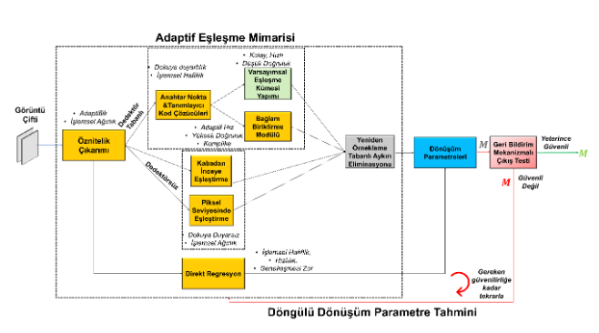

# Multimodal Image Matching

A robust image matching framework featuring an **Adaptive Matching Architecture** with **Iterative Transformation Parameter Estimation**.

## 🏗️ Architecture Overview

### Pipeline Components

#### 1. Feature Extraction
#### 2. Adaptive Matching Architecture
#### 3. Direct Regression
#### 4. Resampling-Based Outlier Elimination
#### 5. Transformation Parameters
#### 6. Feedback Mechanism with Confidence Testing

### Iterative Transformation Parameter Estimation
The system iteratively refines transformation parameters until confidence threshold is met, ensuring robust and accurate matching results.

## 📖 Usage

*Coming soon*

## 📚 References

*Add relevant papers and references here*

## 📄 License

## 👥 Authors

## 🙏 Acknowledgments

*Add acknowledgments*

